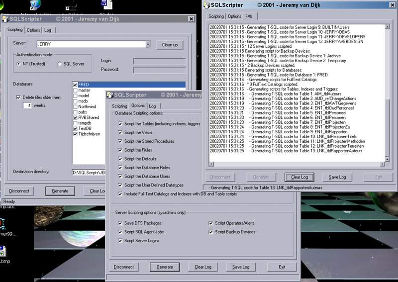



## SQLScripter

### Description

This little application uses SQLDMO to script out objects in SQL Server 7.0 databases (tables, stored procedures, views, defaults, UDTs, full text indexes, etc.), as well as SQL Agent Jobs, Server logins, Operators, Alerts and Backup Devices. It even lets you save DTS packages as Structured storage file. Can be run in GUI mode or unattended/scheduled from the command-line.

The code is a nice example of the use of SQLDMO objects, but even if the code doesn't interest you the application should be useful for SQL Server developers/DBAs who want to generate scripts of their DB objects in a more automated way then SQL Server EM lets you.

----

A short text-file describing use is included.

----

This is not drool-proof paper! Use at your own risk. Don't use on production servers unless your local DBA god has given you explicit permission.

Dependencies are described in the included text file.

----

A short (third-party) review of this tool and an executable-only download can be found at http://www.myitforum.com/articles/18/view.asp?id=3117

----

(Update 20020517 (v2.0.1): Added options to the /DB command-line switch to script out only the user or system databases)

----

(Update 20020701 (v2.1): Server names, login names and authentication modes are now remembered between GUI sessions)
 
### More Info
 

             |
---                |---
**Submitted On**   |2002-07-01 15:18:52
**By**             |[Jeremy van Dijk](https://github.com/Planet-Source-Code/PSCIndex/blob/master/ByAuthor/jeremy-van-dijk.md)
**Level**          |Intermediate
**User Rating**    |5.0 (55 globes from 11 users)
**Compatibility**  |VB 6\.0
**Category**       |[Databases/ Data Access/ DAO/ ADO](https://github.com/Planet-Source-Code/PSCIndex/blob/master/ByCategory/databases-data-access-dao-ado__1-6.md)
**World**          |[Visual Basic](https://github.com/Planet-Source-Code/PSCIndex/blob/master/ByWorld/visual-basic.md)
**Archive File**   |[SQLScripte100568712002\.zip](https://github.com/Planet-Source-Code/jeremy-van-dijk-sqlscripter__1-21939/archive/master.zip)

